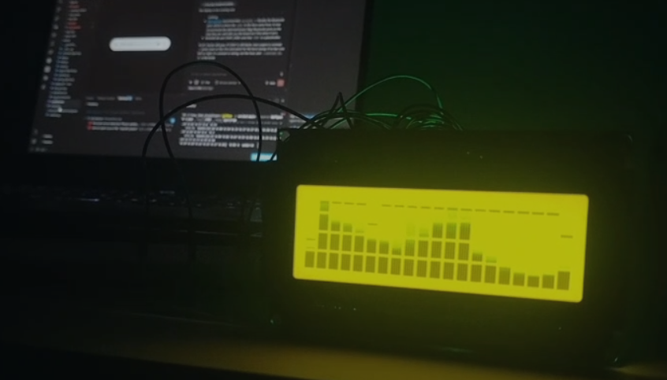

# Audio → LED Visualiser

**A 20×4 character LCD turned into a 20-band, 32-level real-time spectrum
analyser.** Music in, light out, in step with the sound. All the DSP runs on
the host in Python; the Arduino only draws.



*Running live. Twenty mel bands across the columns, 32 levels per bar from
eight user-defined CGRAM glyphs, and the dashes along the top row are the
peak-hold markers -- computed on the Arduino, not sent by the host.*

Built for a Signals & Systems mini-project, on parts that were already in the
box. Nothing needs buying.

| | |
|---|---|
| **Display** | 20×4 HD44780 character LCD (RG2004A / 2004A) as 20 bars × 32 levels, plus 5 optional PWM LEDs |
| **Analysis** | 2048-point FFT, Hann window, 75 % overlap, 20-band mel filter bank, 86.13 frames/s |
| **Latency** | ≈ 26 ms end to end -- under the 45 ms ITU-R BT.1359-1 threshold |
| **Sync** | the track plays through the sound card, which also clocks the frame loop |
| **Link** | 31-byte frames at 115200 baud → 372 fps of headroom against the 86 needed |
| **Modes** | `spectrum`, `mirror`, `wave`, `vu` — from a file, a live mic, or a built-in test track |
| **Needs** | an Arduino Uno, the LCD, two resistors and a capacitor. No FFT library, no LED strip, no sound shield |

```bash
pip install numpy matplotlib sounddevice soundfile pyserial

python find_port.py                 # which COM port is the board?
python -m snsled.main --source song.wav --port COM7
```

Everything below is the *why*: the measurements behind each number, and the
four things that were measured, found wanting, and changed.

---

## 1. Why the Arduino does no DSP

A 2048-point float FFT needs ~16 kB of working RAM. An ATmega328P has
**2 kB total** — 8× short. The largest FFT that fits is 128-point int16,
giving 344 Hz resolution: every bass note in one bin. So the split is forced:

| | does | why |
|---|---|---|
| **Host (Python)** | framing, FFT, filter bank, envelopes, onsets, tempo | has the RAM and the float unit; also lets you *plot* every stage |
| **Arduino** | 20 levels → bar characters → differential redraw | knows what's on the glass, so it can skip unchanged cells |

---

## 2. How a character LCD becomes a spectrum analyser

The RG2004A is a **character** display, not graphics — but the HD44780
controller allows **8 user-defined 5×8 characters** (CGRAM). Define them as
partial vertical bars (1/8 … 8/8 filled from the bottom) and each of the 20
columns becomes a bar **4 cells × 8 px = 32 levels** tall.

That's a 20-band analyser — more bands than six LEDs, and far more than most
student projects manage on a character LCD.

A ninth glyph is free: `-` drawn in an empty cell gives the classic
**peak-hold marker**, computed on the Arduino. Both are visible in the photo
at the top: the solid bars are the CGRAM glyphs, the dashes floating above
them are the peak holds.

---

## 3. Wiring — 16-pin parallel module

| LCD pin | Name | Goes to |
|---|---|---|
| 1 | VSS | GND |
| 2 | VDD | 5 V |
| **3** | **V0** | **contrast — see below** |
| 4 | RS | D12 |
| 5 | RW | GND |
| 6 | E | D13 |
| 7–10 | D0–D3 | *leave unconnected* (4-bit mode) |
| 11 | D4 | D8 |
| 12 | D5 | D7 |
| 13 | D6 | D4 |
| 14 | D7 | D2 |
| 15 | A | 5 V **through 100 Ω** |
| 16 | K | GND |

Pins 12, 13, 8, 7, 4, 2 are the Uno's only non-PWM digital pins besides 0/1,
so the PWM pins stay free for contrast and LEDs.

**Pin 15 (backlight anode) needs a series resistor.** Not every module has a
built-in one, and driving A straight to 5 V can destroy the backlight. 100 Ω
gives 20 mA in the worst case and 8 mA if Vf is 4.2 V — safe either way.

### Contrast (pin 3, V0) — no potentiometer needed

The RC2004A wants **VDD − V0 = 4.4 / 4.5 / 4.6 V** at 25 °C, so with a 5 V
supply V0 must sit between **0.40 and 0.60 V**, typically 0.50 V. That's a
200 mV window — which is exactly why a blank screen is almost always a
contrast problem, not a wiring problem.

**Option A — fixed divider (simplest, zero code):**

```
5 V ──[ 10k ]── V0 ──[ 1k ]── GND        →  0.455 V   works
5 V ──[ 4.7k ]── V0 ──[ 560 ]── GND      →  0.532 V   best
5 V ──[ 8.2k ]── V0 ──[ 1k ]── GND       →  0.543 V   best
```

The rule is a **≈9:1 ratio**. Any 10:1 pair you have (10k/1k, 4.7k/470,
2.2k/220, 1k/100) lands at 0.455 V — in range, slightly dark.

**Option B — software contrast (better, and it's the default):**

```
D9 ──[ 1k ]── V0,  with 10 µF from V0 to GND
```

`USE_PWM_CONTRAST 1` filters a PWM pin into a DC bias, so contrast becomes
a number you tune while the display runs — strictly better than a pot.

The catch, and the fix: at the stock 490 Hz, 1k + 10 µF leaves **32 mV** of
ripple, 16 % of the whole 200 mV window. Rather than demand a bigger
capacitor, raise the carrier — `TCCR1B = (TCCR1B & 0b11111000) | 0x01;`
puts Timer1 at **31.4 kHz**, and the same RC then leaves **1.5 mV**, a 134×
margin. Timer1 doesn't drive `millis()`, so nothing else shifts.

Tune it live with `--contrast N`, where 5 V × N/255 must land in
0.40–0.60 V, so **N = 21…30** (default 26 → 0.51 V).

### Optional LEDs

`D3, D5, D6, D10, D11` each `──[220 Ω]──▶|── GND`, long leg to the resistor.
Five, not six — D9 drives contrast. 220 Ω draws 14.5 mA from a red LED, and
five total 73 mA against the 200 mA chip limit, so USB still powers
everything. Set `USE_LEDS 0` if you're not wiring them.

## 4. ⚠ The I2C trap

**If your module has the PCF8574 backpack, the default `Wire` clock of
100 kHz is too slow and the display will visibly lag the music.**

Each character costs ~6 PCF8574 byte writes (2 nibbles × 3 transfers), about
54 bits:

| Interface | Per char | Achievable fps (p95 frame) | Verdict |
|---|---|---|---|
| 4-bit parallel, direct port | 37 µs | 579 | PASS |
| 4-bit parallel, LiquidCrystal | ~93 µs | 232 | PASS |
| I2C @ **400 kHz** | 135 µs | 159 | PASS |
| I2C @ **100 kHz** (Wire default) | 540 µs | **40** | **FAIL** — need 86 |

`Wire.setClock(400000)` in `setup()` is **not an optimisation, it is
required.** It's already in the sketch.

---

## 5. Differential redraw — what makes it keep up

The host sends 20 **levels**, not 80 characters. The Arduino turns them into
characters and rewrites only the cells that changed, streaming each
contiguous run after a single `setCursor` (a cursor move costs the same
37 µs as a character, so minimising *runs* matters as much as minimising
*characters*).

Measured on the test track: **17.6 of 80 cells change per frame** (p95 = 37)
— a **4.5× saving**. Without it, I2C at 400 kHz would not pass either.

---

## 6. Quick start

```bash
pip install numpy matplotlib

python -m snsled.report_figures    # 11 figures, no hardware needed
python validate.py                 # 90 checks
python -m snsled.main              # full pipeline, virtual display

# with hardware
python -m snsled.main --port COM3 --mode spectrum
python -m snsled.main --source song.wav --port /dev/ttyACM0 --mode mirror
python -m snsled.main --source song.wav --port COM3 --audio-latency low
python -m snsled.main --source mic --port COM3 --mode wave
```

**Run `python find_port.py` first and use the port it marks as your Arduino.**
`COM3` above is a placeholder, and on Windows it is very often the Bluetooth
serial port instead. That one *opens without error and discards every frame*,
so the bars scroll, the audio plays, and the LCD stays blank with nothing in
the log to explain it. Windows also renumbers the board when you replug it or
reboot, so re-check whenever the display goes dark for no reason.

Flash `firmware/lcd_sink/lcd_sink.ino`. On boot it sweeps a single bar
across all 20 columns — if that doesn't run left to right, your wiring or
column order is wrong.

**Modes:** `spectrum`, `mirror`, `wave`, `vu`.

### The music plays too, and it stays in step

`--source song.wav` goes to the sound card as well as to the FFT -- no extra
flag needed, `--no-audio` turns it off. Two independent things have to be
right before it looks synchronised, and only one of them is obvious.

**Rate.** `OutputStream.write()` blocks until the card has room for the next
hop, so the loop runs on the sound card's crystal instead of on
`perf_counter()`. Nothing trims one clock to the other, so a free-running
sleep loop drifts one way for the whole track: 100 ppm is 24 ms over a
4-minute song, and it is worst exactly where it is most obvious, at the end.

**Phase.** Whatever the DAC is playing right now was handed to it
`stream.latency` ago -- **209 ms** on this machine's default output, 93 ms
with `--audio-latency low`. Lighting frame *k* the instant block *k* is
written would therefore put the display a whole output buffer *ahead* of the
sound: 4.6x the 45 ms ITU-R BT.1359-1 threshold, and light-before-sound is
the direction the eye catches first. So frames go through a FIFO
`round(latency / 11.61 ms)` hops deep and are sent when their own audio
reaches the speaker. What is left is the hop quantisation, at most 5.8 ms.

Two consequences that look like bugs and are not. The display stays blank for
the first `latency` -- correct, the speaker is silent then too. And the
closing frames are clocked out over silence written *after* the track ends,
which is what puts the last bar on the last beat instead of 209 ms early.

The wav is resampled to 44 100 Hz once and both paths index the same array,
so sound and light cannot slip a sample. The speakers keep both channels;
the filter bank still sees the mono sum, because one row of bars is one
signal.

| flag | does |
|---|---|
| `--no-audio` | analyse only, exactly as before |
| `--volume 0.4` | speakers only -- the FFT always sees the peak-normalised signal, so turning it down does not dim the display |
| `--av-offset -12` | trim by hand, in ms; positive holds the lights back |
| `--audio-latency low` | 93 ms of buffer instead of 209 ms: shorter blank start, less margin against underrun |
| `--audio-device 7` | pick an output; `python -m sounddevice` lists them |

`--source mic` never plays -- monitoring a live microphone through the
speakers is a feedback loop. The run summary reports `under=` (card ran dry)
in place of `late=` whenever playback is on.

---

## 7. The serial protocol

```
host → Arduino :  0xAA 0x55 <nLcd> <nLed> <contrast> <lcd..> <led..> xor
```

31 bytes for 20 bars + 5 LEDs + a live contrast byte → 2.69 ms at
115200 baud → **372 fps**.
Free-running, no handshake: neither `analogWrite()` nor the LCD write path
disables interrupts, so there's no blackout window to lose bytes in. (A
WS2812B strip *would* need a handshake — FastLED disables interrupts for the
whole strobe. That sketch is in `firmware/led_sink/` if you ever get one.)

---

## 8. Design parameters

| Parameter | Value | Consequence |
|---|---|---|
| Sample rate | 44 100 Hz | 22 050 Hz usable |
| Window `N` | 2048 | Δf = 21.53 Hz; ≥12 bins even in the lowest of 20 bands |
| Hop | 512 (75 % overlap) | 86.13 frames/s, decoupled from `N` |
| Window function | Hann | side lobes −31.5 dB, ENBW 1.5 bins → effective 32.3 Hz |
| Filter bank | 20 mel bands, 20 Hz–16 kHz | one per LCD column, area-normalised |
| Envelope | attack 1.00 / release 0.12 | 0 ms attack lag, 91 ms release |
| Display | 20 × 32 levels | 8 CGRAM glyphs + space + peak marker |
| **Latency** | **≈26 ms** | under the 45 ms ITU threshold |

Δt · Δf = 46.44 ms × 21.53 Hz = **1.000** — the uncertainty product, exactly.

---

## 9. Course-topic map

| Concept | Where it lives |
|---|---|
| Sampling, Nyquist | `Config.fs`, anti-alias filter in the sound card |
| Time–frequency uncertainty | `N` vs `hop`; `fig01` |
| Windowing, leakage | `STFT.win`; `fig02` |
| DFT / FFT | `STFT.push` |
| Convolution | windowing in time = convolution in frequency → `fig02` |
| Filter banks | `mel_filterbank`; `fig04` |
| LTI systems, IIR, poles | `AsymmetricEnvelope`; `fig05` |
| Step / impulse response | `fig05(c)` |
| Non-linear systems | asymmetric attack/release — *why* it beats the LTI version |
| Autocorrelation | `estimate_tempo`; `fig06` |
| Quantisation | 32 display levels; 8-bit PWM + gamma keeps 184 of 256 |
| Multirate | 44 100 Hz → 86.13 fps → display refresh |
| Group delay / latency | `fig08` |

---

## 10. Four documented failure modes

All found by measurement. Each deserves a paragraph in the report.

**(a) A symmetric smoother fails the perceptual sync target.**
Smooth enough to look good (α = 0.12) costs 209 ms of attack lag, putting the
chain near 64.7 ms end-to-end. Light lagging sound is detectable beyond
45 ms (ITU-R BT.1359-1). Asymmetric attack/release cuts it to ≈26 ms.

**(b) The onset detection function is not an onset event.**
Thresholding the continuous ODF directly fired on **35.6 % of frames** —
every frame of every attack — so beat effects stuttered instead of pulsing.
Peak detection with an adaptive threshold plus a 100 ms refractory period
brings it to 2.3 % of frames and exactly 120 events/min on a 120 BPM track.

**(c) Beat sensitivity does not trade off smoothly.**

| `rel_thresh` | events/s | median interval | CV | locks to |
|---|---|---|---|---|
| 0.15 | 3.92 | 0.255 s | **0.038** | tatum |
| 0.25 | 3.25 | 0.255 s | **0.337** | nothing — irregular |
| 0.35 | 2.00 | 0.499 s | **0.083** | beat |

Rhythm is quantised into a metrical hierarchy, so a threshold *between* two
levels catches all of one and only some of the next. 0.25 — the obvious
first guess — was the worst value available.

**(d) The display interface, not the DSP, is the bottleneck.**
The whole signal chain runs in 0.12 ms. Getting 80 characters onto the glass
over 100 kHz I2C takes 43 ms. Throughput analysis of the *output* stage
turned out to matter more than optimising any filter.

**Also rejected:** inter-onset-interval statistics for tempo. Onset times are
quantised to the 11.61 ms hop *and* biased per instrument, giving 126 ms
residuals and >90 % tempo error. Autocorrelation and comb filtering use the
whole detection function and average this out.

---

## 11. Files

```
snsled/dsp.py             framing, FFT, mel bank, envelope, onsets, events, tempo
snsled/leds.py            LcdMapper + PwmMapper + LedMapper, gamma, power, bar glyphs
snsled/runtime.py         audio sources, output sinks, the real-time loop
snsled/main.py            command-line entry point
snsled/report_figures.py  all 11 report figures
validate.py               90-check PASS/FAIL report
firmware/lcd_sink/        20x4 LCD + 6 PWM LEDs        <- use this one
firmware/pwm_sink/        6 PWM LEDs only
firmware/led_sink/        WS2812B strip, if you ever get one
figures/                  generated PNGs (regenerate: python -m snsled.report_figures)
docs/                     the photo used in this README
```

`song.wav` and other audio are deliberately **not** in the repo -- see
`.gitignore`. Point `--source` at any file on your own disk.

`validate.py` includes a bit-exact model of the firmware's integer bar maths
and checks it against the host renderer over all 1024 level/row
combinations, so the two cannot silently drift apart.

---

## 12. Build order

| Week | Milestone | Needs |
|---|---|---|
| 1 | Audio I/O, framing, Hann, FFT, spectrogram | nothing |
| 2 | Mel bank, envelopes, virtual display | nothing |
| 3 | LCD wired and lit from Python; measure latency at 240 fps on a phone | LCD + 1k + 10 µF |
| 4 | Onsets → events → tempo; peak-hold | same |
| 5 | All four modes, live mic, optional LEDs | + 5 LEDs |
| 6 | Report, measured plots, viva | — |
